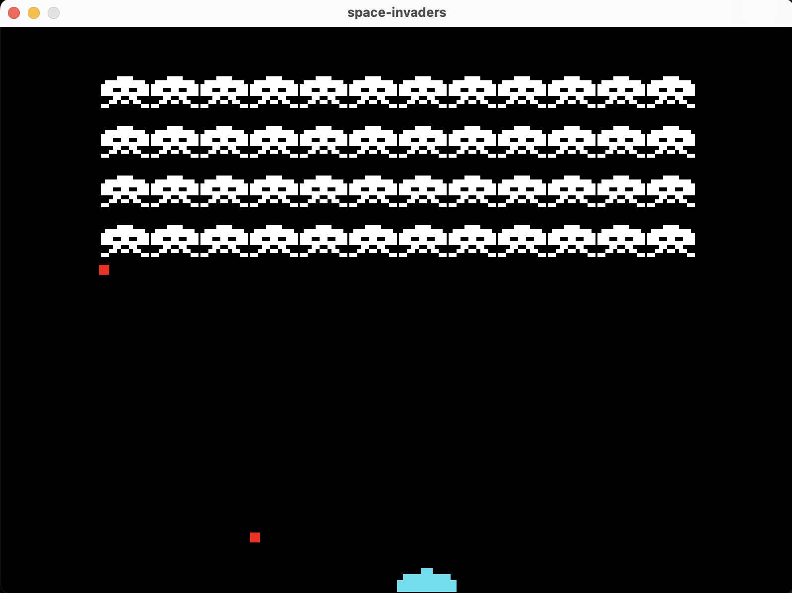

Space Invaders Clone
==================

Description
-----------

Space Invaders Clone is a Java-based arcade-style game where the player controls a spaceship and must destroy incoming enemy ships. The game features continuous enemy waves, player-controlled shooting, and collision detection.

Features
--------

-   Player movement (left and right)
-   Enemy spawns and movement
-   Shooting mechanics
-   Collision detection
-   Restart functionality

--------
 
 

Getting Started
---------------

### Prerequisites

-   Java JDK 11 or higher
-   Integrated Development Environment (IDE) like IntelliJ IDEA, Eclipse, or similar

### Installation

1.  Clone the repository:

    bash

    Copy code

    `git clone https://github.com/doandroidsdreamof/space-invaders.git`

2.  Open the project in your IDE.

3.  Build the project to resolve dependencies.

Controls
--------

-   **Arrow Left/Right**: Move the spaceship left or right.
-   **Space**: Shoot bullets.

Development
-----------

This project is structured into several packages:

-   `constants`: Holds game configuration constants.
-   `entities`: Contains classes for player, enemies, and bullets.
-   `inputs`: Manages user inputs.
-   `ui`: User interface components like buttons.
-   `utils`: Utility classes like collision detection and enemy management.
-   `game`: Core game execution and rendering logic.

### Adding New Features

To add new features, follow the project's coding conventions and document new methods. If adding new classes or modifying the game's behavior, ensure compatibility with existing components.

Contributing
------------

Contributions are welcome. For major changes, please open an issue first to discuss what you would like to change. Ensure to update tests as appropriate.